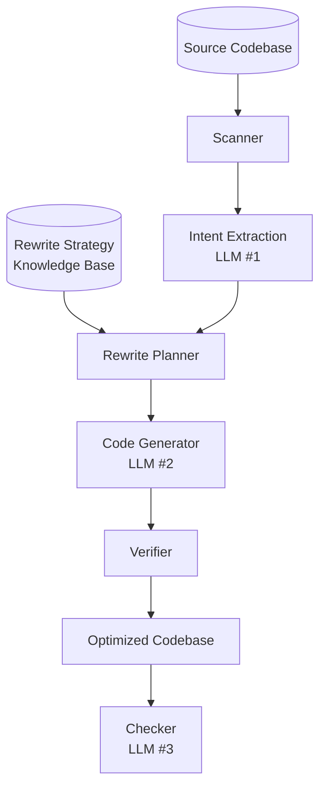

# adco — Application-Database Co-design

Application-Database Co-design (ADCo): jointly analyze **application code** and **database interactions** to find optimization opportunities invisible to either layer in isolation.

Scan any codebase, detect DB interactions, extract intent, apply rewrite strategies from the knowledge base, and generate optimized code. TPC-C benchmark serves as a built-in test case.



## Project Structure

| Path | Purpose |
|------|---------|
| `engine/main.py` | **Engine entry point** — generic pipeline with CLI |
| `engine/scanner.py` | **Scanner** — walks codebase, builds project tree, lists source files |
| `engine/extractor.py` | **Intent Extractor** — **LLM call #1**: analyzes scanned code, returns structured `IntentSpec` |
| `engine/intent.py` | **Intent data structures** — `IntentSpec`, `TransactionIntent`, `QueryIntent` |
| `engine/planner.py` | **Planner** — parses KB strategies, maps intent → rewrite plan |
| `engine/generator.py` | **Generator** — **LLM call #2**: builds prompt from scan + intent + plan + KB |
| `engine/verifier.py` | **Verifier** — compile check, extensible validation |
| `engine/pipeline.py` | **Pipeline orchestrator** — 5 steps: scanner → intent_extractor → planner → code_generator → verifier |
| `engine/.env` | `GOOGLE_API_KEY`, project, location, vertex config for Gemini |
| `checker/ast_checker.py` | **Checker** — LLM-based correctness checker with structured output + static guardrail |
| `checker/__main__.py` | Checker CLI trampoline |
| `telemetry/` | SQLite-backed telemetry for engine, checker, and TPC-C runs (5 tables) |
| `Makefile` | Workflow targets: `gen`, `baseline`, `run`, `check`, `chain`, `clean`, `clean-all` |
| `AGENTS.md` | Full project context, architecture patterns, known bugs |
| `docs/kb/query_rewrite_methods.md` | Knowledge base: 5 rewrite strategies with TPC-C from→to examples |
| `tpcc/drivers/mysqldriver.py` | Baseline — one query at a time, per TPC-C spec |
| `tpcc/drivers/optimizedmysqldriver.py` | Generated optimized reference driver |
| `tpcc/scripts/correctness_check.py` | Record-and-replay correctness verification |
| `tpcc/scripts/record_run.py` | TPC-C benchmark wrapper with telemetry recording |
| `tpcc/scripts/cleanup_db.sh` | Drop all TPC-C databases |
| `tpcc/runtime/executor.py` | TPC-C workload generator |
| `tpcc/constants.py` | All TPC-C constants |
| `tpcc/tpcc.py` | Main benchmark entry point |
| `tpcc/configs/mysql.config` | MySQL connection configs |
| `db/mysql/docker-compose.yml` | MySQL 5.7 container |

## Make Targets

| Target | Description |
|--------|-------------|
| `make gen` | Generate optimized driver (`gemini-3.5-flash-lite`) |
| `make baseline` | Run baseline driver (1 warehouse, 60s, no telemetry) |
| `make run` | Run optimized driver with telemetry recording |
| `make check` | Run correctness checker on generated driver |
| `make chain` | Full pipeline: gen → check → run → clean (continues on failure) |
| `make clean` | Drop `tpcc-candidates` database |
| `make clean-all` | Drop all TPC-C databases |

## CLI Reference

### Engine (`python -m engine.main`)

```bash
uv run python -m engine.main tpcc/drivers/mysqldriver.py \
    --runner tpcc/tpcc.py \
    --with tpcc/drivers/abstractdriver.py \
    --with tpcc/constants.py \
    --output-dir tpcc/drivers

# Flags
--model gemini-2.5-flash       # default Gemini model
--runner, -r <path>             # entry point file (required)
--with, -w <path>               # support file (repeatable)
--output-dir <dir>              # output directory
--kb <path>                     # knowledge base path
--llm-delay <seconds>           # delay between LLM calls (default: 5)
--dry-run                       # print prompts without calling LLM
```

### Checker (`python -m checker`)

LLM-based correctness checker with a static syntax guardrail and structured JSON output. Predicts whether generated code will fail at runtime.

```bash
uv run python -m checker tpcc/drivers/optimizedmysqldriver.py
uv run python -m checker <file> --model gemini-3.5-flash-lite
uv run python -m checker                      # auto-detect latest driver
uv run python -m checker <file> --json        # machine-readable output

# Flags
--model gemini-2.5-flash        # default Gemini model
--json, -j                      # JSON output
```

**Failure categories:**

| Category | Description |
|----------|-------------|
| `not_executable` | Syntax errors, incomplete code, bad imports |
| `name_error` | Undefined/hallucinated variables, missing imports |
| `db_error` | Placeholder mismatch, unreplaced markers, API misuse |
| `reward_hacking` | Stubs, hardcoded values, gutted logic |
| `slow` | N+1 queries, missing `executemany`, unmerged SELECTs |

### TPC-C Benchmark (`python tpcc/tpcc.py`)

```bash
# Baseline driver (no telemetry)
uv run python tpcc/tpcc.py mysql \
    --config=tpcc/configs/mysql.config \
    --warehouses=4 --duration=10 --clients=1

# Optimized driver (via telemetry wrapper)
uv run python tpcc/scripts/record_run.py optimizedmysql \
    --config=tpcc/configs/mysql.config \
    --warehouses=4 --duration=60 --clients=1

# Flags
--config <path>                # driver config file
--warehouses N                 # number of warehouses
--duration D                   # benchmark duration in seconds
--clients N                    # number of clients
--reset                        # reset database before running
--no-load                      # skip data loading
--no-execute                   # skip workload execution
--scalefactor SF               # scale factor
--ddl <path>                   # path to DDL SQL file
--stop-on-error                # stop on first transaction error
--print-config                 # print default config and exit
--debug                        # enable debug logging
```

## Pipeline Architecture

The engine (`engine/pipeline.py`) runs 5 steps:

1. **Scanner** — walks codebase, builds project tree, reads source files
2. **Intent Extractor** — **LLM call #1**: returns structured `IntentSpec` (transactions, queries, dataflow)
3. **Planner** — parses KB strategies, maps intent → rewrite plan
4. **Code Generator** — **LLM call #2**: builds prompt, generates optimized code
5. **Verifier** — compile check + extensible validators

The **Checker** is a separate tool (`checker/ast_checker.py`) that runs post-generation. It statically checks syntax (guardrail), then sends code to an LLM with a structured schema to predict runtime failures across 5 categories.

## Rewrite Strategies

Five strategies from `docs/kb/query_rewrite_methods.md`:

| Strategy | Description |
|----------|-------------|
| COMBINING_QUERIES | Merge N sequential queries into one (JOINs, IN clauses, batch writes) |
| PREDICATE_PUSHDOWN | Filter early — derived tables before joins reduce scan size |
| JOIN_ORDER_HINTS | STRAIGHT_JOIN to force known-efficient join order |
| SEPARATING_QUERIES | Split monolithic queries into independent steps |
| CONCURRENCY | Set-based IN clauses replace per-item loops |

## Telemetry

SQLite-backed (`telemetry/telemetry.db`) with auto-linking via `# ADCO_RUN_ID` embedded in generated files.

**Tables:**

| Table | Granularity | Key columns |
|-------|-------------|-------------|
| `engine_runs` | One row per run | `model`, `run_status`, `total_duration_ms`, `total_input_tokens`, `total_output_tokens` |
| `engine_steps` | One row per step (FK→engine_runs) | `step`, `step_duration_ms`, `llm_input_tokens`, `llm_output_tokens` |
| `checker_runs` | One row per run (linked via `engine_run_id`) | `checker_status`, `failure_category`, `reason`, `llm_input_tokens`, `llm_output_tokens` |
| `tpcc_runs` | One row per run (linked via `engine_run_id`) | `driver`, `benchmark_duration_s`, `total_executed`, `total_tps`, `txn_status`, `missing_txns` |
| `tpcc_txns` | One row per txn type (FK→tpcc_runs) | `txn_type`, `status`, `executed`, `time_us` |

## Config File Format

```ini
[driver-name]
host = 127.0.0.1
port = 3306
user = root
password = your_password
database = tpcc-baseline
```

Generated drivers use `[candidates]` (database `tpcc-candidates`).

## Extending

To add a new TPC-C driver manually:
1. Create `tpcc/drivers/<name>driver.py` with a class `<Name>Driver(AbstractDriver)`
2. The runner derives the class name via `name.title() + "Driver"` (e.g. `optimizedmysql` → `OptimizedmysqlDriver`)
3. Add a `[<name>]` section to `tpcc/configs/mysql.config`

## Credits

Based on the original [`apavlo/py-tpcc`](https://github.com/apavlo/py-tpcc) by Andy Pavlo and contributors. Extended for LLM-generated query optimization benchmarking and application-database co-optimization.
