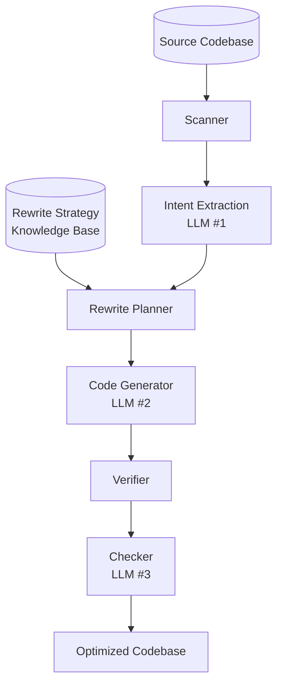

# adco — Application-Database Co-design

Application-Database Co-design (ADCo): jointly analyze **application code** and **database interactions** to find optimization opportunities invisible to either layer in isolation.

Scan any codebase, detect DB interactions, extract intent, apply rewrite strategies from the knowledge base, and generate optimized code. TPC-C benchmark is a built-in test case — running without arguments auto-detects the baseline MySQL driver and applies TPC-C-specific rules and validation.



## Project Structure

| Path | Purpose |
|------|---------|
| `engine/main.py` | **Entry point** — TPC-C preset (default) or generic pipeline |
| `engine/scanner.py` | **Scanner** — walks codebase, detects SQL strings, `cursor.execute()`, ORM calls, connection strings |
| `engine/extractor.py` | **Intent Extractor** — **LLM call #1**: analyzes scanned code, returns structured intent |
| `engine/intent.py` | **Intent data structures** — `IntentSpec`, `TransactionIntent`, `QueryIntent` |
| `engine/planner.py` | **Planner** — parses KB strategies, maps intent → rewrite plan |
| `engine/generator.py` | **Generator** — **LLM call #2**: builds dynamic prompt from scan + extracted intent + plan + KB |
| `engine/verifier.py` | **Verifier** — compile check, extensible validation |
| `engine/pipeline.py` | **Pipeline orchestrator** — ties scanner → extractor → planner → generator → verifier |
| `engine/.env` | `GOOGLE_API_KEY` for Gemini |
| `checker/ast_checker.py` | **Checker** — LLM-based correctness checker with static guardrail |
| `checker/__main__.py` | Checker CLI entry point |
| `Makefile` | Workflow targets: `gen`, `run`, `check`, `gen-run`, `clean` |
| `AGENTS.md` | Full project context, architecture patterns, known bugs |
| `docs/kb/query_rewrite_methods.md` | Knowledge base: 5 rewrite strategies with TPC-C from→to examples |
| `docs/queries/` | Full SQL comparison across all drivers for all 5 transactions |
| `tpcc/drivers/mysqldriver.py` | Baseline — one query at a time, per TPC-C spec |
| `tpcc/drivers/optimizedmysqldriver.py` | Generated optimized reference driver |
| `tpcc/scripts/correctness_check.py` | Record-and-replay correctness verification |
| `tpcc/runtime/executor.py` | TPC-C workload generator |
| `tpcc/constants.py` | All TPC-C constants |
| `tpcc/tpcc.py` | Main benchmark entry point |
| `tpcc/configs/mysql.config` | MySQL connection configs |
| `db/mysql/docker-compose.yml` | MySQL 5.7 container |

## Make Targets

| Target | Description |
|--------|-------------|
| `make gen` | Generate optimized TPC-C driver (hardcoded: `gemini-3.5-flash`) |
| `make run` | Benchmark the generated optimizedmysql driver |
| `make check` | Run correctness checker on `optimizedmysqldriver.py` |
| `make gen-run` | Generate + benchmark in one step |
| `make clean` | Drop only `tpcc-candidates` database |
| `make clean-all` | Drop all TPC-C databases |

## CLI Reference

### Engine (`python -m engine.main`)

```bash
# Generate with all required args
uv run python -m engine.main tpcc/drivers/mysqldriver.py \
    --runner tpcc/tpcc.py \
    --with tpcc/drivers/abstractdriver.py \
    --with tpcc/constants.py \
    --output-dir tpcc/drivers

# Flags
--model gemini-3.5-flash      # default, Gemini model
--runner <path>                # entry point file (required)
--with <path>                  # support file (repeatable)
--output-dir <dir>             # output directory
--kb <path>                    # knowledge base path
--llm-delay <seconds>          # delay between LLM calls (default: 5)
--dry-run                      # print prompts without calling LLM
```

### Checker (`python -m checker`)

LLM-based correctness checker with a static syntax guardrail. Predicts whether
generated code will fail at runtime and categorizes the failure.

```bash
uv run python -m checker tpcc/drivers/optimizedmysqldriver.py
uv run python -m checker <file> --model gemini-3.5-flash
uv run python -m checker                      # auto-detect latest driver
uv run python -m checker <file> --json        # machine-readable output

# Flags
--model gemini-3.5-flash       # default, Gemini model
--json, -j                     # JSON output
```

**Failure categories:**
| Category | Description |
|----------|-------------|
| `not_executable` | Syntax errors, incomplete code, bad imports |
| `name_error` | Undefined/hallucinated variables, missing imports |
| `db_error` | Placeholder mismatch, unreplaced markers, API misuse |
| `reward_hacking` | Stubs, hardcoded values, gutted logic |
| `slow` | N+1 queries, missing `executemany`, unmerged SELECTs |

### TPC-C Benchmark (`python tpcc/tpcc.py`)

```bash
# Run the baseline driver
uv run python tpcc/tpcc.py mysql \
    --config=tpcc/configs/mysql.config \
    --warehouses=4 --duration=10 --clients=1

# Run the optimized driver
uv run python tpcc/tpcc.py optimizedmysql \
    --config=tpcc/configs/mysql.config \
    --warehouses=4 --duration=10 --clients=1

# Flags
--config <path>                # driver config file
--warehouses N                 # number of warehouses
--duration D                   # benchmark duration in seconds
--clients N                    # number of clients (use 1 to avoid race condition)
--reset                        # reset database before running
--no-load                      # skip data loading
--no-execute                   # skip workload execution
--scalefactor SF               # scale factor
--debug                        # enable debug logging
```

## Pipeline Architecture

The engine (`engine/pipeline.py`) uses a unified pipeline for all codebases:

1. **Scanner** (`scanner.py`) — walks the codebase, detects DB interactions via regex patterns, and produces a `CodebaseProfile` (db_type, db_api, tags like `tpcc`)
2. **Intent Extractor** (`extractor.py`) — **LLM call #1**: analyzes the scanned code and returns a structured `IntentSpec` (transactions, queries, dataflow, round-trip counts)
3. **Planner** (`planner.py`) — parses KB strategies from `docs/kb/query_rewrite_methods.md`, maps extracted intent → rewrite plan
4. **Generator** (`generator.py`) — **LLM call #2**: builds a dynamic prompt from scan + extracted intent + plan + KB, generates optimized code
5. **Verifier** (`verifier.py`) — compile check + extensible validators
6. **Checker** (`checker/ast_checker.py`) — **LLM call #3** (optional): statically checks syntax, then sends code to an LLM to predict runtime failures across 5 categories

## Rewrite Strategies

Five strategies from `docs/kb/query_rewrite_methods.md`:

| Strategy | Description |
|----------|-------------|
| COMBINING_QUERIES | Merge N sequential queries into one (JOINs, IN clauses, batch writes) |
| PREDICATE_PUSHDOWN | Filter early — derived tables before joins reduce scan size |
| JOIN_ORDER_HINTS | STRAIGHT_JOIN to force known-efficient join order |
| SEPARATING_QUERIES | Split monolithic queries into independent steps |
| CONCURRENCY | Set-based IN clauses replace per-item loops |

## Config File Format

```ini
[driver-name]
host = 127.0.0.1
port = 3306
user = root
password = your_password
database = tpcc-baseline
```

Generated drivers use `[candidates]` (database `tpcc-candidates`).

## Extending

To add a new TPC-C driver manually:
1. Create `tpcc/drivers/<name>driver.py` with a class `<Name>Driver(AbstractDriver)`
2. Add a `[<name>]` section to `tpcc/configs/mysql.config`

## Credits

Based on the original [`apavlo/py-tpcc`](https://github.com/apavlo/py-tpcc) by Andy Pavlo and contributors. Extended for LLM-generated query optimization benchmarking and generic application-database co-optimization.
