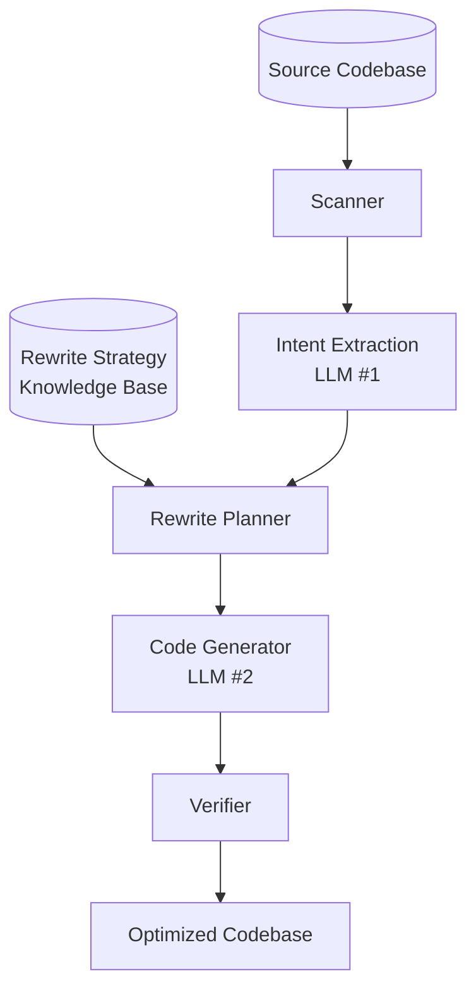

# adco — Application-Database Co-design

Application-Database Co-design (ADCo): jointly analyze **application code** and **database interactions** to find optimization opportunities invisible to either layer in isolation.

Scan any codebase, detect DB interactions, extract intent, apply rewrite strategies from the knowledge base, and generate optimized code. TPC-C benchmark is a built-in test case — running without arguments auto-detects the baseline MySQL driver and applies TPC-C-specific rules and validation.



## Project Structure

| Path | Purpose |
|------|---------|
| `engine/main.py` | **Entry point** — TPC-C preset (default) or generic pipeline |
| `engine/scanner.py` | **Scanner** — walks codebase, detects SQL strings, `cursor.execute()`, ORM calls, connection strings |
| `engine/extractor.py` | **Intent Extractor** — **LLM call #1**: analyzes scanned code, returns structured intent |
| `engine/intent.py` | **Intent data structures** — `IntentSpec`, `TransactionIntent`, `QueryIntent` |
| `engine/planner.py` | **Planner** — parses KB strategies, maps intent → rewrite plan |
| `engine/generator.py` | **Generator** — **LLM call #2**: builds dynamic prompt from scan + extracted intent + plan + KB |
| `engine/verifier.py` | **Verifier** — compile check, extensible validation |
| `engine/pipeline.py` | **Pipeline orchestrator** — ties scanner → extractor → planner → generator → verifier |
| `engine/.env` | `GOOGLE_API_KEY` for Gemini |
| `Makefile` | Workflow targets: `gen`, `run`, `genrun`, `gen-generic`, `test-*`, `clean*` |
| `AGENTS.md` | Full project context, architecture patterns, known bugs |
| `docs/kb/query_rewrite_methods.md` | Knowledge base: 5 rewrite strategies with TPC-C from→to examples |
| `docs/queries/` | Full SQL comparison across all drivers for all 5 transactions |
| `tpcc/drivers/baselinemysqldriver.py` | Baseline — one query at a time, per TPC-C spec |
| `tpcc/drivers/deepseekv4flashmysqlv2driver.py` | v2 — handwritten optimized reference |
| `tpcc/drivers/*driver.py` | Generated candidate drivers |
| `tpcc/scripts/correctness_check.py` | Record-and-replay correctness verification |
| `tpcc/runtime/executor.py` | TPC-C workload generator |
| `tpcc/constants.py` | All TPC-C constants |
| `tpcc/tpcc.py` | Main benchmark entry point |
| `tpcc/configs/mysql.config` | MySQL connection configs |
| `mysql/docker-compose.yml` | MySQL 5.7 container |

## Make Targets

| Target | Description |
|--------|-------------|
| `make gen` | Generate TPC-C driver with default model |
| `make gen MODEL=gemini-2.5-flash` | Generate with a custom model |
| `make gen-generic GENERIC_PATH=./project` | Optimize any codebase generically |
| `make run <driver>` | Benchmark a TPC-C driver (10s, no load, 1 client) |
| `make gen-run` | Generate + benchmark in one step |
| `make test-unit`| AST-based static checks (no MySQL needed) |
| `make test-tpcc`| TPC-C integration test (MySQL required) |
| `make clean` | Drop only `tpcc-candidates` database |
| `make clean-all` | Drop all TPC-C databases |

Model variable defaults to `gemini-2.5-flash`.

## Usage

### Generate an Optimized Driver

The engine auto-detects TPC-C when the input is the baseline driver — injecting TPC-C-specific rules and validation. Any other codebase runs through the generic pipeline with KB strategies.

```bash
# TPC-C: generate with default model
make gen

# TPC-C: custom model
make gen MODEL=gemini-2.5-pro

# Generic: optimize any codebase
make gen-generic GENERIC_PATH=./my-project

# Dry-run (inspect prompt without calling API)
uv run python -m engine.main --dry-run

# Just print the output filename stem
uv run python -m engine.main --print-name

# Specify codebase path + output directory
uv run python -m engine.main ./my-project --output-dir=./optimized
```

**Note**: Must use `python -m engine.main` (not `python engine/main.py`) for module imports.
Output file: `tpcc/drivers/{model_name}_{timestamp}driver.py`.

### Benchmark a TPC-C Driver

```bash
# Run candidates driver (generated)
uv run python tpcc/tpcc.py candidates --config=tpcc/configs/mysql.config --duration=10 --no-load --clients=1

# Run via Makefile
make run candidates

# Generate + run in one step
make genrun
```

**Note**: `--clients > 1` has a known race condition on `D_NEXT_O_ID`. Use `--clients=1`.

### Reset Database

```bash
# Drop and reload all databases
make cleanall

# Drop only the candidates database
make clean

# Load data into a specific database
uv run python tpcc/tpcc.py baselinemysql --config=tpcc/configs/mysql.config --warehouses=4 --reset
```

## Running Tests

### AST-Based Static Checker (no MySQL needed)

Analyses the generated driver's source code using `ast.parse()` + source text patterns to detect correctness issues without executing any code. Covers 12 checks.

```bash
make test-unit

# Or directly:
uv run python tests/ast_checker.py --auto            # latest gemini driver
uv run python tests/ast_checker.py --driver <path>   # specific file
uv run python tests/ast_checker.py --auto --verbose  # show details
uv run python tests/ast_checker.py --auto --json     # machine-readable
```

### Integration Test (MySQL required)

Record-and-replay correctness verification across all databases.

```bash
make test-tpcc
```

Requires all MySQL databases to be loaded with identical data (same RNG state). See `AGENTS.md` for details.

## Pipeline Architecture

The engine (`engine/pipeline.py`) uses a unified pipeline for all codebases:

1. **Scanner** (`scanner.py`) — walks the codebase, detects DB interactions via regex patterns, and produces a `CodebaseProfile` (db_type, db_api, tags like `tpcc`)
2. **Intent Extractor** (`extractor.py`) — **LLM call #1**: analyzes the scanned code and returns a structured `IntentSpec` (transactions, queries, dataflow, round-trip counts)
3. **Planner** (`planner.py`) — parses KB strategies from `docs/kb/query_rewrite_methods.md`, maps extracted intent → rewrite plan
4. **Generator** (`generator.py`) — **LLM call #2**: builds a dynamic prompt from scan + extracted intent + plan + KB, generates optimized code
5. **Verifier** (`verifier.py`) — compile check + extensible validators

### TPC-C Auto-Detection

The scanner detects TPC-C from code content (table names WAREHOUSE/DISTRICT/CUSTOMER, method signatures doDelivery/doNewOrder, TXN_QUERIES dict, or `from tpcc` imports). When `tpcc` is in the profile tags, the engine injects TPC-C-specific rules into the generation prompt and applies TPC-C-specific validation (5 transaction methods, TXN_QUERIES dict, 4 required batch helpers).

## Rewrite Strategies

Five strategies from `docs/kb/query_rewrite_methods.md`:

| Strategy | Description |
|----------|-------------|
| COMBINING_QUERIES | Merge N sequential queries into one (JOINs, IN clauses, batch writes) |
| PREDICATE_PUSHDOWN | Filter early — derived tables before joins reduce scan size |
| JOIN_ORDER_HINTS | STRAIGHT_JOIN to force known-efficient join order |
| SEPARATING_QUERIES | Split monolithic queries into independent steps |
| CONCURRENCY | Set-based IN clauses replace per-item loops |

## Config File Format

```ini
[driver-name]
host = 127.0.0.1
port = 3306
user = root
password = your_password
database = tpcc-baseline
```

Generated drivers use `[candidates]` (database `tpcc-candidates`).

## Extending

To add a new TPC-C driver manually:
1. Create `tpcc/drivers/<name>driver.py` with a class `<Name>Driver(AbstractDriver)`
2. Add a `[<name>]` section to `tpcc/configs/mysql.config`

To optimize a new codebase generically: `make gen-generic GENERIC_PATH=<path>`.

## Credits

Based on the original [`apavlo/py-tpcc`](https://github.com/apavlo/py-tpcc) by Andy Pavlo and contributors. Extended for LLM-generated query optimization benchmarking and generic application-database co-optimization.
